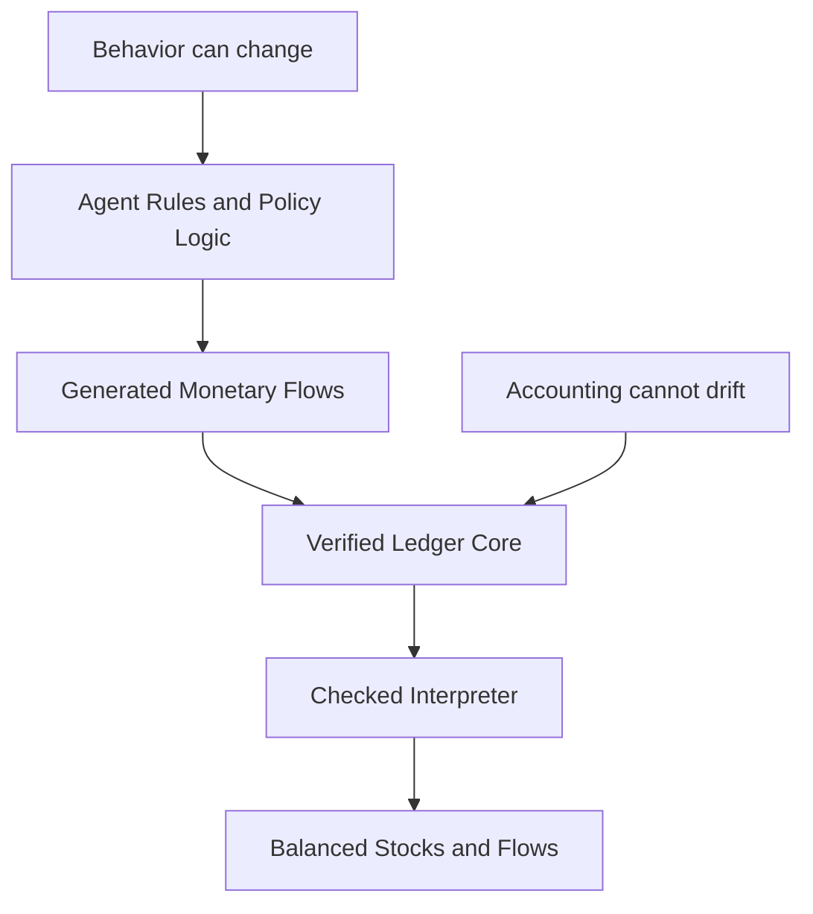

# amor-fati-ledger

[](https://github.com/boombustgroup/amor-fati-ledger/actions/workflows/ci.yml)
[](https://github.com/boombustgroup/amor-fati-ledger/actions/workflows/verify.yml)

Verified accounting kernel for Stock-Flow Consistent (SFC) simulation engines.

`amor-fati-ledger` is a double-entry flow engine with a formally verified reference model and production implementations constrained by shared contracts, executable reference semantics, and equivalence tests.

Most simulation engines treat accounting consistency as a debugging concern. `amor-fati-ledger` treats it as part of the execution model.

Built for [amor-fati](https://github.com/boombustgroup/amor-fati), a macroeconomic SFC-ABM simulation engine.

> Economic narratives may fail. The ledger must not.

This repository exists to provide the hard floor under simulation work: if a model branch produces a bad macro regime, that may be a modeling problem; if the ledger breaks, the simulation itself is wrong.



## What It Guarantees

- A formally verified reference core in `src/main/scala-stainless/Verified.scala` proves conservation, frame conditions, sequential application, distribution exactness, and bounded runtime refinement properties.
- The pure production interpreter and the imperative fast path are tested against shared reference semantics and explicit execution contracts.
- Overflow, index bounds, batch shape, and non-negative amounts are checked explicitly on runtime execution paths.
- Distribution uses a shared pure executable model (`DistributeModel`) that is tested against both the production adapter and the verified `BigInt` shape.

Full verification boundaries, trust-chain details, and architecture notes live in [docs/verification.md](docs/verification.md).

## Public API

- [Interpreter.scala](src/main/scala/com/boombustgroup/ledger/Interpreter.scala)  
  Pure `Map`-based execution with `canApplyFlow`, `canApplyAll`, `applyCheckedFlow`, and `applyCheckedAll`.
- [ImperativeInterpreter.scala](src/main/scala/com/boombustgroup/ledger/ImperativeInterpreter.scala)  
  Fast mutable execution path with checked batch execution, `ValidatedBatchPlan`, and preferred `planAndApplyAll`.
- [Distribute.scala](src/main/scala/com/boombustgroup/ledger/Distribute.scala)  
  Production distribution adapter over the shared pure `DistributeModel`.
- [verify.sh](verify.sh)  
  Runs Stainless + Z3 over the reference model.

## Run

```bash
# Tests
sbt test

# Formal verification (requires Stainless standalone + Z3)
./verify.sh
```

## Tech Stack


- **Scala 3.8** (Stainless standalone bundles its own 3.7.2 compiler)
- **Stainless** (EPFL) — formal verification for Scala, powered by Z3
- **Z3** (Microsoft Research) — SMT solver
- **ScalaCheck** — property-based testing
- **Long-based arithmetic** — all amounts are `Long` (scale 10^4), avoiding floating-point error within bounded integer arithmetic

## Further Reading

- [docs/verification.md](docs/verification.md) — verification scope, trust chain, proof boundaries, and internal architecture notes
- [amor-fati](https://github.com/boombustgroup/amor-fati) — macroeconomic SFC-ABM simulation engine

## License

Apache 2.0 — Copyright 2026 [BoomBustGroup](https://www.boombustgroup.com/)
